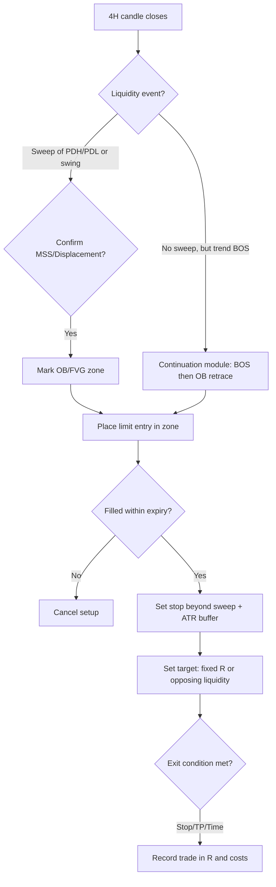

# Smart Money Concepts (SMC) Trading Bot

**XAU/USD | 4H Timeframe | MT5 Platform | Deriv Broker | Python 3.9+**

## One-Click Start

**Windows:** Double-click `START_BOT.bat`

**Any terminal:**
```
python start_bot.py
```

That’s it. It installs everything, asks for your credentials, and launches the bot.

## Requirements

- Python 3.9+ (tested on 3.9.13)
- MetaTrader 5 terminal (Windows only for live trading)
- Deriv MT5 account

### Packages (auto-installed by `start_bot.py`)

```
MetaTrader5>=5.0.45
numpy>=1.24.0,<2.1.0
pandas>=1.5.0,<2.3.0
```

Or install manually: `pip install -r requirements.txt`

## How the Bot Works



### Two Trade Templates

| Template | Trigger | Entry | Target |
|---|---|---|---|
| **Reversal** | Liquidity sweep + MSS/displacement | Limit order at OB zone | Opposing liquidity pool or fixed R |
| **Continuation** | Break of Structure in trend direction | Limit order at OB retrace | Next liquidity pool or fixed R |

### Risk Management

- **Position sizing:** `lots = (equity * r%) / (stop_distance * contract_size)`
- **Max 1 position** at a time (configurable)
- **Daily loss limit:** stops trading after 1% daily loss
- **Drawdown brake:** halves risk after rolling N-trade drawdown
- **Break-even:** moves stop to entry + offset after +1R
- **Time stop:** closes after 48 candles (192 hours)
- **Spread filter:** skips trades when spread is too wide
- **Volatility filter:** skips when ATR exceeds 95th percentile

## Project Structure

```
start_bot.py          # One-click installer + launcher
START_BOT.bat         # Windows double-click launcher
run_bot.py            # Bot launcher with CLI flags
requirements.txt      # Python packages
smart_money_bot/
  __init__.py
  config.py           # All tunable parameters (dataclasses)
  models.py           # Data models (Candle, SwingPoint, OrderBlock, etc.)
  smc_engine.py       # SMC analysis (ATR, swings, sweeps, MSS, OB, FVG)
  signals.py          # Reversal + Continuation signal generators
  risk_manager.py     # Position sizing, exposure limits, drawdown brakes
  trade_manager.py    # Order placement, fill monitoring, paper trading
  mt5_manager.py      # MT5 connection, data retrieval, order execution
  bot.py              # Main orchestrator loop
  settings.json       # Your config (credentials, parameters)
```

## Configuration

Edit `smart_money_bot/settings.json` or let `start_bot.py` walk you through it.

Key parameters:

| Parameter | Default | Range | What it does |
|---|---|---|---|
| `risk_per_trade_pct` | 0.35% | 0.10-0.60% | Equity risked per trade |
| `swing_length` | 3 | 2-6 | Bars left/right for fractal pivot |
| `body_atr_multiplier` | 1.0 | 0.5-2.0 | Displacement threshold (k * ATR) |
| `entry_fraction` | 0.50 | 0.30-0.70 | Where in OB zone to enter |
| `atr_buffer_multiplier` | 0.25 | 0.10-0.50 | Stop buffer beyond reference |
| `fixed_r_multiple` | 1.8 | 1.3-3.0 | Take profit in R-multiples |
| `max_hold_candles` | 48 | 18-72 | Time stop in 4H candles |
| `daily_loss_limit_pct` | 1.0% | - | Stop trading after this daily loss |
